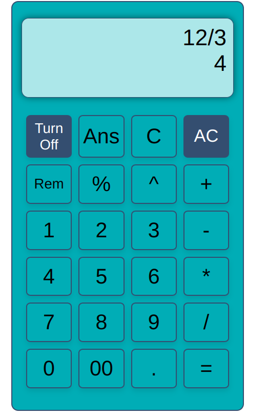

# Calculator App

A basic calculator web application built using HTML, CSS, and JavaScript. Perform basic arithmetic operations such as addition, subtraction, multiplication, and division. Additional features include percentage calculations and finding the remainder.

> This was one of the early projects I built to learn and practice CSS and JavaScript.

## Live Site

Check out the calculator in action: [calculator.asiradnan.com](https://calculator.asiradnan.com)

## Features

- **Basic Operations:** Perform addition, subtraction, multiplication, and division.
- **Percentage Calculation:** Quickly calculate percentages for any value.
- **Remainder Calculation:** Find the remainder after division.
- **Responsive Design:** Use the calculator on various devices with a responsive layout.

## Screenshots

